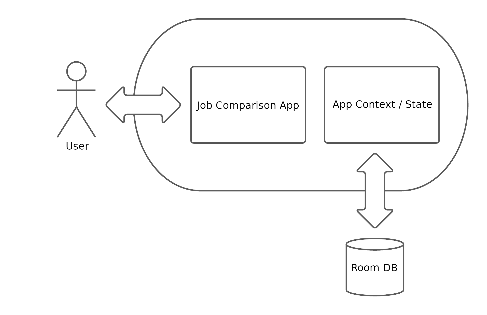

# Design Document

**Author**: Andre Thompson

## Introduction

This document provides interested parties with an overview of the entire system, expands upon how we as developers designed the system, and includes our thoughts on how we implemented the system. This is a living and breathing document and will be updated during the longevity of the design phase of this application.

## System Overview

For the proposed system a user will have the ability to compare jobs and track job offers they receive. As it can be complicated to compare job offers with benefits, in different locations, and other aspects beyond salary. This app will be a single-user job offer comparison app with this in mind comes the need for a single user layout of the system that will be further expressed through the use of some system diagrams.

## 1 Design Considerations

With a newly proposed system comes the need to evaluate the design and thus make design considerations based on the requirements of the system. The companion app is a sole user focused app. With this in mind the system architecture is a big design consideration. The architecture of the system defines the system on a conceptual level and defines the structure of the system. With this, one will be able to realize at a high level how the system will be used and maintained. For this app the architecture will realize how a user will interact with our app to create job offers, maintain their current job's features, compare jobs and also to maintain/persist this information throughout the app's lifetime. The architecture of the design also defines how the components of the system interact to make up the system at large. Accessibility is an important feature that needs to be factored into design consideration. Anyone with an Android phone should be able to utilize this app. Language, being another design consideration we as developers are creating an English based app and will not support other languages on the first iteration of the app. Performance is a metric for all successful app and for this app performance is very important. Short load times and user interaction with the app components needs to be short and flawless.

### 1.1 Assumptions

- The app will not need to have an internet connection
- The data for a user using the app will only need to be stored on that user's device
- There will not be multiple users using the same app
- The requirements will not change
- The software delivery date will not change

### 1.2 Constraints

#### 1.2.1 Business Constraints

- System must be finished and implemented by: 21 March 2021
- All design components and documents must be updated during the lifecycle of development
- There will only be 4 team members working on this project

#### 1.2.2 Technical Constraints

- The app must be built for Android in Android Studio
- The app must be implemented in Java
- Data saved by the user must persist in the app even after shut down
- East of use of the GUI

### 1.3 System Environment

- Will run on Android 11 (API 30)
- JDK 1.8 will be used to implement
- Android Studio 4.1.2 will be the preferred IDE
- Persistence will be implemented using Room Database

## 2 Architectural Design

The architectural design of this system follows a simplified high level approach. We have the core Job Comparison App that handles the creation of jobs, comparison of jobs, weighting comparison settings, etc. To ensure persistence when the user restarts the application, the data will pass through app activities via App Context (i.e. the state) and will ultimately be stored to a Room database.

### 2.1 Component Diagram

This component diagram outlines the different underlying functional components that build up the system described in the architecture above. From the diagram, it can be seen what services each component offers and which components rely on these services.

### 2.2 Deployment Diagram

Given that the system is single-user and relatively simple, there is no need to design and follow a deployment diagram. The system will exist independently on a mobile device without interaction with other systems (authentication, firewall, etc.) other than the persistent storage solution. Therefore, when individual components are deployed to the system, only the system itself will be impacted which we cover in integration testing.

## 3 Low-Level Design

The internal system will utilize two main components - as described in the architecture above - the application itself and the persistence solution (Room DB). In the following class diagram, the application will be well defined in its entirety excluding the GUI interaction (discussed in a later section). As for the database interaction of the system, this will be defined further in the sequence/state diagram below.

### 3.1 Class Diagram

### 3.2 Sequence Diagram

## 4 User Interface Design

This section covers the initial mockups of the app prior to its construction. These designs will be used as baselines for the final product, but will of course, evolve throughout the course of the project.

### Main Menu

- The main menu of this system will display links to the abilities of the user (1) enter current job details, (2) enter job offers, (3) adjust the comparison settings, or (4) compare job offers:\
&nbsp;

### Enter Current Job / Job Offer

- Entering job offers and current jobs will look very similar thus there is only one mockup design for these 2 views:\
&nbsp;

### Adjust Comparison Settings

- The user will have the ability to adjust comparison settings, a mockup GUI design for this is below:\
&nbsp;

### Compare Job Offers

- The user will have the ability to perform job comparisons and job offers will be ranked in order: \
&nbsp;

